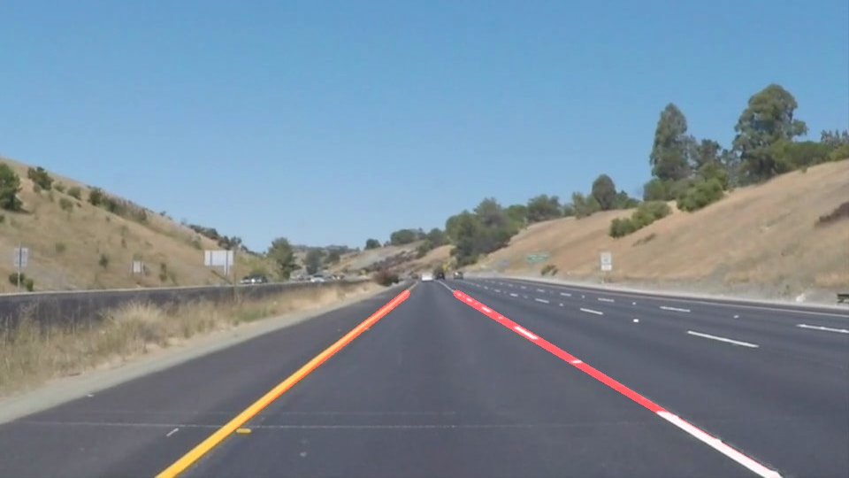

# **Finding Lane Lines on the Road** 

## Writeup Template

### You can use this file as a template for your writeup if you want to submit it as a markdown file. But feel free to use some other method and submit a pdf if you prefer.

---

**Finding Lane Lines on the Road**

The goals / steps of this project are the following:

* Make a pipeline that finds lane lines on the road
* Reflect on your work in a written report

<!---
your comment goes here
-->

[//]: # (Image References)

[image1]: test_images_output/i_gray.png "Gray"
[image2]: test_images_output/i_blurred.png "Blurred Gray"
[image3]: test_images_output/i_canny.png "Canny Edge Detection"
[image4]: test_images_output/i_mask1.png "Canny Edge Detection (Mask applied)"
[image5]: test_images_output/i_mask2.png "Mask Lines"
[image6]: test_images_output/i_hough.png "Lines Detected (Hough Transform)"
---

### Reflection

### 1. Describe your pipeline. As part of the description, explain how you modified the draw_lines() function.

* My pipeline consisted of 6 steps: 
	
    1. First, I converted the input image to gray-scale, a necessary prior process to compute the gradient and the edge-detection later. An illustration is shown in the next figure:
    ![alt text][image1]
        
    1. Second, we apply a Gaussian smoothing kernel (size: 5 pixels) to the Gray image. The result is as shown below:
    ![alt text][image2]

    1. Third, we apply the Canny detection algorithm in the Blurred Gray image. We find that a low(high) threshold of 10(250) maximizes the detection of line edges in the image. This combination of parameters also filters out false positive detection of edges in the road, as shown in the next Figure:
    ![alt text][image3]

    1. But we're only interested in objects within the road, therefore we apply a mask to filter any detection outside a region of interest (ROI) which is an user-input. Our ROI is a 4-side polygon, which roughly delimits a lane in the field of view of the camera. The defined ROI and its effect in the Canny output image are shown below: 
    ![alt text][image5]  ![alt-text][image4]
    
    1. Fifth, we want to identify lines in the output of the Canny Edge image. To this end we adjusted all the parameters of the Hough Transform in polar coordinates until we obtained a good result. Other than the resolution parameters, critical ones include the # of intersections in a Hough cell (=10), the # of pixels making up a line (=1), and the maximum gap between connectible line segments (=1 pixel). The result is shown in the next Figure:
    ![alt text][image6]

    1. Finally we co-add the line image (from the Hough Transform) with the original input. These results will be shown in the next Section.

* In order to draw a single line on the left and right lanes, I modified the draw_lines() function:  

    1. The Hough Transform lines are a collection of (x1,y1,x2,y2) points, where the sub-index 1 denotes the beginning-point, and the sub-index 2 symbolizes the end-point of a given line. 

    1. To discriminate between left-lane and right-lane segments I used the slope (easily derived from the previous pair of coordinates), **and** the position in the image. Both criterias were combined into an "if" conditional statement. Applying only the first criteria lead to some bogus detections. Negative (positive) slopes corresponded to the left (right) segments of the lane.
    
    1. I'll continue the explanation with the left part of the lane segments, but it's completely analogous for the right. Once I have the left line segments, I find the center of mass for each one of them. This results in a series of points (x,y coordinates) in the left line of the lane.

    1. We derive a a linear least square fit to the aforementioned points, using a modified version of this [code](https://en.wikipedia.org/wiki/Linear_least_squares_(mathematics)#Python). 
    
    1. With the best-fit parameters obtained (slope and y-axis intercept), I just draw lines that extend within the defined region of interest.

Here we show the results of the pipeline in the test images. In the left column we have results for the original draw_line() function, and in the right column we have the results for the improved draw_line() function:

solidWhiteCurve:
  
---
solidWhiteRight
  
---
solidYellowCurve2
  
---
solidYellowCurve
  
---
whiteCarLaneSwitch
  
---
solidYellowLeft
  

### 2. Identify potential shortcomings with your current pipeline

1. One potential shortcoming of the pipeline (which comes from the video-part) is the "jittering" problem. Although not severe for our pipeline, it could be minimized if the results of the best-linear fit of the center-of-mass points had been dynamically averaged for a few (previous) frames at each instant

1. Another shortcoming is that the region of interest (ROI) is static. The 4-side polygon, which roughly delimits a lane in the field of view of the camera, is assumed to be the same for all the test images and the videos. This is not robust as small changes in the camera mounting place could render the pipeline useless.

1. If there were other cars changing lanes (and thus "eclipsing" lines) the pipeline would momentarily not work.

1. A final shortcoming is that all the other parameters of the Canny edge detection and Hough transform have been fine-tuned to work with the data at hand. In this respect, changes in the weather (or illumination of the image), different types of lane boundaries, different color lane boundaries, obstacles on the road, etc) would make our pipeline not to work.

### 3. Suggest possible improvements to your pipeline

* To trust the pipeline in a self-driving car we would need to improve mainly in the shortcomings listed above. (See the previous list and answers below) 

    1. The solution to the jittering problem is straightforward. We need to storage the best-fit parameters for the left and right lines frame to frame. However we should not draw the resulting lines from frame-by-frame results, but rather apply a moving average that includes the current and (let's say) 2 previous images. In this way the line parameters go through smoother changes and thus the jittering is minimized.  

    1. We can provide support for a dynamic ROI, which would make the pipeline robust against e.g. camera-mounting changes, or different lane widths. Each scenario would need a "learning" period to derive a ROI, maybe driven by neural network training.
    
    1. We could implement cost functions and optimization techniques to not depend on visual inspection of results and fine-tuning of the parameters of different algorithms within the pipeline (e.g. Canny edge detection and Hough transform to obtain lines).
    

